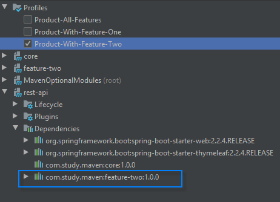

# Multi-Module Architecture With Optional Modules 


## Introduction

This project demonstrates a multi-module architecture with a special ability to maintain optional feature modules.


## Project Structure

Here is a list of modules and the dependency tree.

- MavenOptionalModules (Parent)
- rest-api
- core
- feature-one
- feature-two

And here is a dependency tree,

```
MavenOptionalModules
└── rest-api
    ├── feature-one
    │   └── core
    ├── feature-two
    │   └── core
    └── core
```


## Architecture

### Business Module : core

This module is a business layer. It is defined to cover some core logic that is important and required for the application.

This module can be used to keep some common logic to reduce redundancy in the project. In our case, the [Feature](core/src/main/java/com/study/feature/Feature.java) interface and the [FeatureFactory](core/src/main/java/com/study/feature/FeatureFactory.java) class is put there that serves features to the [FeatureController](rest-api/src/main/java/com/study/controller/FeatureController.java) class.

>**Note:** One thing to take care here is, if this module has any other module's dependency then make sure you do not end in cyclic dependencies.


### Application Module : rest-api

This module would serve all the rest API calls. So basically, it is an application layer.

Spring Boot is used here to make the app bootable.

#### Feature Request Handler

There is a class named [FeatureController](rest-api/src/main/java/com/study/controller/FeatureController.java), that is designed to handle feature requests.

A feature request is a URL like below,
```http request
http://localhost:8081/feature/feature1/5
```

The controller handles this request URL as a dynamic URL in below format where `featureName` and `id` both are considered as input parameters of handler to serve feature request.
 ```text
/feature/{featureName}/{id}
```

The controller class uses [FeatureFactory](core/src/main/java/com/study/feature/FeatureFactory.java) to get a feature implementation based on feature name. 

The factory will have all the child class objects available in the build. So if the build is with all feature modules then factory will have all the Feature impl class objects. And if the build is with selective feature modules, then the factory will have those feature impl objects only.

To add a new feature support, a class needs to implement the [Feature](core/src/main/java/com/study/feature/Feature.java) interface. That is a contract, based on which the Feature Factory serves feature implementations.


### Feature Modules : feature-one, feature-two

The Feature Modules are like feature specific source-code. A common purpose to separate features from core module is to make it maintainable and to keep the overall structure scalable.

When any feature is in production and getting continuous updates, issues like required refactoring every time as the logic is tangled in-between multiple features. Separate module structure helps in that scenario. 

And, as we are focusing on optional features, we have forced here to separate feature wise separate modules in this project architecture.

In our case, all the feature modules will have dependency of 'core' module because of the [Feature](core/src/main/java/com/study/feature/Feature.java) interface.


## Maven Profiles with Dependency Configuration 

### Idea

The idea behind this sample project was to develop a multi-module project with configurations to enable or disable feature modules and its dependency.

For reference, a main module rest-api and feature sub-modules feature-one, feature-two is designed here as shown above in dependency tree.

### Profile Configuration

To enable/disable a feature module, profiles are designed in the root POM. And, the same profiles are extended in the rest-api module for to add dependencies based on needs. ID of the profiles are important in this context.

Here is a root POM part that covers modules based on application needs. (i.e. Application with all features or with specific feature only)
```xml
    <profiles>
        <profile>
            <id>Product-With-Feature-One</id>
            <modules>
                <module>rest-api</module>
                <module>core</module>
                <module>feature-one</module>
            </modules>
        </profile>
        <profile>
            <id>Product-With-Feature-Two</id>
            <modules>
                <module>rest-api</module>
                <module>core</module>
                <module>feature-two</module>
            </modules>
        </profile>
        <profile>
            <id>Product-All-Features</id>
            <modules>
                <module>rest-api</module>
                <module>core</module>
                <module>feature-one</module>
                <module>feature-two</module>
            </modules>
        </profile>
    </profiles>
```   

And, the rest-api POM part that covers dependencies.
```xml
    <profiles>
        <profile>
            <id>Product-With-Feature-One</id>
            <dependencies>
                <dependency>
                    <groupId>com.study.maven</groupId>
                    <artifactId>core</artifactId>
                    <version>${app.version}</version>
                </dependency>
                <dependency>
                    <groupId>com.study.maven</groupId>
                    <artifactId>feature-one</artifactId>
                    <version>${app.version}</version>
                </dependency>
            </dependencies>
        </profile>
        <profile>
            <id>Product-With-Feature-Two</id>
            <dependencies>
                <dependency>
                    <groupId>com.study.maven</groupId>
                    <artifactId>core</artifactId>
                    <version>${app.version}</version>
                </dependency>
                <dependency>
                    <groupId>com.study.maven</groupId>
                    <artifactId>feature-two</artifactId>
                    <version>${app.version}</version>
                </dependency>
            </dependencies>
        </profile>
        <profile>
            <id>Product-All-Features</id>
            <dependencies>
                <dependency>
                    <groupId>com.study.maven</groupId>
                    <artifactId>core</artifactId>
                    <version>${app.version}</version>
                </dependency>
                <dependency>
                    <groupId>com.study.maven</groupId>
                    <artifactId>feature-one</artifactId>
                    <version>${app.version}</version>
                </dependency>
                <dependency>
                    <groupId>com.study.maven</groupId>
                    <artifactId>feature-two</artifactId>
                    <version>${app.version}</version>
                </dependency>
            </dependencies>
        </profile>
    </profiles>
```

Then after, it becomes so easy with GUI in IDEs where Maven related operational UI is available. Check this IntelliJ Idea screenshots below,

- **All Features Profile** - It loads rest-api module with all feature's dependencies


- **Feature-One Profile** - It loads rest-api module with only feature-one's dependency


- **Feature-Two Profile** - It loads rest-api module with only feature-two's dependency



As you can see in the images above, you only need to select a profile to make your project work or build the artifact with only required modules.

You can define the profiles configuration based on your application needs.

Please note that, at the time of a profile deselection, the IDE may show you an alert asking you to remove modules from project. You can select "No" to keep your all module source loaded in the IDE.


 
 
### Making A Build
 
 Maven provides command to make artifact of any maven based project.
 i.e.
 ```shell script
mvn clean install
```
 In this project as we have configured few profiles, the maven command will follow the selection of profile and prepare build based on that.
 
 So, if we take an example `Profile With All Features`, then the `mvn clean install` command on root module will prepare a rest-api.jar with both feature modules' dependencies.
 
 And in case of of `Profile With Only Feature One`, then the `mvn clean install` command on root module will prepare a rest-api.jar with feature-one module dependency only.
 